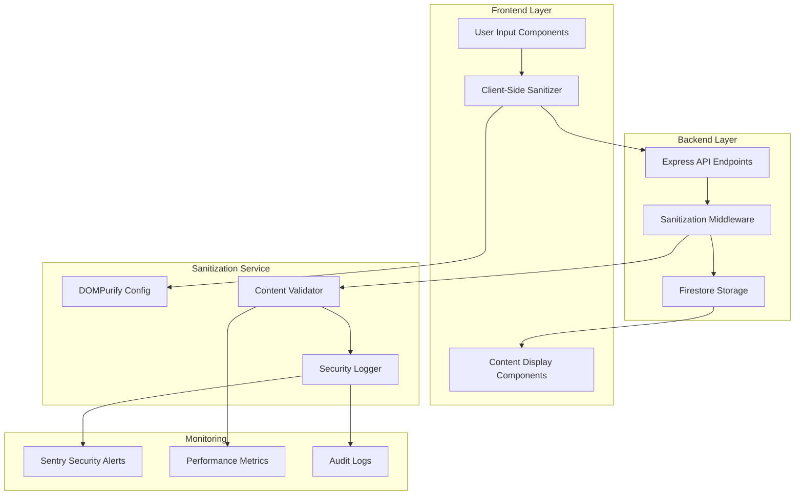

# Design Document

## Overview

The DOMPurify security integration is designed as a comprehensive content sanitization layer that protects the pet card generator application from XSS attacks while preserving user experience. The solution implements a centralized sanitization service that integrates with existing React components, Firebase functions, and data storage layers.

The design follows a defense-in-depth approach with sanitization occurring at multiple points: input validation, data storage, and output rendering. This ensures that malicious content cannot bypass security measures through any attack vector.

## Architecture

### High-Level Security Architecture



### Technology Integration

**Frontend Sanitization:**
- DOMPurify 3.x for client-side HTML sanitization
- React integration with custom hooks for sanitized content
- TypeScript interfaces for sanitized data types
- Real-time validation feedback for user inputs

**Backend Sanitization:**
- DOMPurify server-side integration with jsdom
- Express middleware for automatic request sanitization
- Firebase Functions sanitization before Firestore writes
- Content validation service with configurable rules

**Security Monitoring:**
- Sentry integration for security event tracking
- Custom metrics for sanitization performance
- Audit logging for compliance and forensics
- Rate limiting for suspicious content patterns

## Components and Interfaces

### Frontend Components

#### Sanitization Hook
```typescript
interface UseSanitizedContentHook {
  sanitize: (content: string, options?: SanitizeOptions) => string;
  sanitizeAsync: (content: string, options?: SanitizeOptions) => Promise<string>;
  isLoading: boolean;
  error: Error | null;
}

interface SanitizeOptions {
  allowedTags?: string[];
  allowedAttributes?: Record<string, string[]>;
  stripIgnoreTag?: boolean;
  stripIgnoreTagBody?: string[];
}
```

#### Sanitized Input Components
```typescript
interface SanitizedInputProps {
  value: string;
  onChange: (sanitizedValue: string) => void;
  placeholder?: string;
  allowedTags?: string[];
  maxLength?: number;
  onSecurityViolation?: (violation: SecurityViolation) => void;
}

interface SanitizedTextAreaProps extends SanitizedInputProps {
  rows?: number;
  autoResize?: boolean;
}

interface SecurityViolation {
  type: 'script_tag' | 'dangerous_attribute' | 'suspicious_pattern';
  originalContent: string;
  sanitizedContent: string;
  timestamp: Date;
}
```

#### Content Display Components
```typescript
interface SafeHTMLDisplayProps {
  content: string;
  className?: string;
  fallbackComponent?: React.ComponentType;
  onRenderError?: (error: Error) => void;
}

interface PetCardSafeDisplayProps {
  card: PetCard;
  showMetadata: boolean;
  onContentError?: (error: ContentError) => void;
}
```

### Backend API Interfaces

#### Sanitization Service
```typescript
interface SanitizationService {
  sanitizeHTML(content: string, options?: SanitizeOptions): Promise<SanitizedResult>;
  sanitizeUserProfile(profile: UserProfile): Promise<UserProfile>;
  sanitizePetCardMetadata(metadata: CardMetadata): Promise<CardMetadata>;
  validateContent(content: string): Promise<ValidationResult>;
}

interface SanitizedResult {
  sanitizedContent: string;
  originalContent: string;
  removedElements: string[];
  securityViolations: SecurityViolation[];
  processingTime: number;
}

interface ValidationResult {
  isValid: boolean;
  violations: SecurityViolation[];
  riskLevel: 'low' | 'medium' | 'high' | 'critical';
  recommendedAction: 'allow' | 'sanitize' | 'block' | 'flag';
}
```

#### Middleware Integration
```typescript
interface SanitizationMiddleware {
  sanitizeRequest: (req: Request, res: Response, next: NextFunction) => void;
  sanitizeBody: (fields: string[]) => MiddlewareFunction;
  sanitizeQuery: (fields: string[]) => MiddlewareFunction;
  logSecurityEvents: (req: Request, violations: SecurityViolation[]) => void;
}

interface SecurityEventLog {
  userId?: string;
  ipAddress: string;
  userAgent: string;
  endpoint: string;
  violations: SecurityViolation[];
  timestamp: Date;
  severity: 'info' | 'warning' | 'error' | 'critical';
}
```

## Data Models

### Sanitization Configuration
```typescript
interface DOMPurifyConfig {
  allowedTags: string[];
  allowedAttributes: Record<string, string[]>;
  allowedSchemes: string[];
  allowedSchemesByTag: Record<string, string[]>;
  stripIgnoreTag: boolean;
  stripIgnoreTagBody: string[];
  keepContent: boolean;
}

interface SecurityPolicy {
  userProfiles: DOMPurifyConfig;
  petCardMetadata: DOMPurifyConfig;
  comments: DOMPurifyConfig;
  socialSharing: DOMPurifyConfig;
}
```

### Enhanced Data Models
```typescript
interface SanitizedPetCard extends PetCard {
  metadata: SanitizedCardMetadata;
  sanitizationInfo: {
    lastSanitized: Date;
    violationsFound: number;
    sanitizationVersion: string;
  };
}

interface SanitizedCardMetadata extends CardMetadata {
  petName: string; // Always sanitized
  breed: string; // Always sanitized
  description?: string; // Sanitized HTML allowed
  customTags: string[]; // Array of sanitized tags
}

interface SanitizedUserProfile extends User {
  displayName: string; // Sanitized
  bio?: string; // Sanitized HTML allowed
  sanitizationInfo: {
    lastUpdated: Date;
    profileVersion: string;
  };
}
```

### Security Monitoring Models
```typescript
interface SecurityMetrics {
  totalSanitizations: number;
  violationsBlocked: number;
  averageProcessingTime: number;
  topViolationTypes: Record<string, number>;
  suspiciousUsers: string[];
  performanceImpact: number;
}

interface AuditLog {
  id: string;
  userId?: string;
  action: 'sanitize' | 'block' | 'flag' | 'allow';
  contentType: 'profile' | 'card' | 'comment' | 'social';
  originalContent: string;
  sanitizedContent: string;
  violations: SecurityViolation[];
  timestamp: Date;
  ipAddress: string;
  userAgent: string;
}
```

## Error Handling

### Security Error Classification
```typescript
enum SecurityErrorType {
  SANITIZATION_FAILED = 'sanitization_failed',
  MALICIOUS_CONTENT_DETECTED = 'malicious_content_detected',
  RATE_LIMIT_EXCEEDED = 'rate_limit_exceeded',
  CONFIGURATION_ERROR = 'configuration_error',
  PERFORMANCE_THRESHOLD_EXCEEDED = 'performance_threshold_exceeded'
}

interface SecurityError extends Error {
  type: SecurityErrorType;
  severity: 'low' | 'medium' | 'high' | 'critical';
  userId?: string;
  contentType: string;
  originalContent?: string;
  violations: SecurityViolation[];
  timestamp: Date;
}
```

### Error Handling Strategies

**Frontend Error Handling:**
- Graceful degradation to plain text when sanitization fails
- User-friendly error messages without exposing security details
- Automatic retry with exponential backoff for transient failures
- Content validation feedback with suggestions for safe formatting

**Backend Error Handling:**
- Fail-secure approach: block content when sanitization fails
- Comprehensive logging of all security events
- Automatic alerting for critical security violations
- Circuit breaker pattern for DOMPurify service failures

**Security Event Response:**
- Immediate blocking of critical violations
- Rate limiting for users with repeated violations
- Escalation procedures for persistent security threats
- Automated incident response for high-severity events

## Testing Strategy

### Security Testing Approach

**XSS Attack Simulation:**
- Test common XSS payloads against all input fields
- Verify script tag removal and attribute sanitization
- Test DOM clobbering and prototype pollution attempts
- Validate sanitization of encoded and obfuscated attacks

**Performance Testing:**
- Benchmark sanitization performance with various content sizes
- Load testing with concurrent sanitization requests
- Memory usage monitoring during heavy sanitization loads
- Latency impact assessment on user experience

**Integration Testing:**
- End-to-end testing of sanitized content flow
- Database integrity testing with sanitized data
- Cross-browser compatibility testing for DOMPurify
- Mobile device testing for sanitization performance

### Test Coverage Requirements
```typescript
const securityTestCoverage = {
  sanitizationFunctions: {
    branches: 95,
    functions: 100,
    lines: 95,
    statements: 95
  },
  securityMiddleware: {
    branches: 90,
    functions: 100,
    lines: 90,
    statements: 90
  },
  errorHandling: {
    branches: 85,
    functions: 95,
    lines: 85,
    statements: 85
  }
};
```

### Security Test Scenarios
- **Malicious Script Injection**: Test various script tag variations and event handlers
- **HTML Injection**: Test dangerous HTML elements and attributes
- **CSS Injection**: Test style-based attacks and expression injections
- **URL Injection**: Test javascript: and data: URL schemes
- **Encoding Bypass**: Test URL encoding, HTML entities, and Unicode normalization
- **Content Length Attacks**: Test extremely long content and nested structures
- **Rate Limiting**: Test rapid-fire malicious content submission
- **Configuration Tampering**: Test behavior with invalid or malicious configurations

## Performance Considerations

### Optimization Strategies
- **Caching**: Cache sanitization results for identical content
- **Lazy Loading**: Sanitize content only when needed for display
- **Batch Processing**: Group multiple sanitization requests
- **Worker Threads**: Use web workers for heavy sanitization tasks
- **Content Streaming**: Stream and sanitize large content progressively

### Performance Monitoring
- Track sanitization processing times per content type
- Monitor memory usage during sanitization operations
- Alert on performance degradation beyond acceptable thresholds
- Optimize DOMPurify configuration based on usage patterns

### Scalability Design
- Horizontal scaling of sanitization services
- Load balancing for sanitization endpoints
- Database indexing for audit logs and security events
- CDN integration for sanitized static content