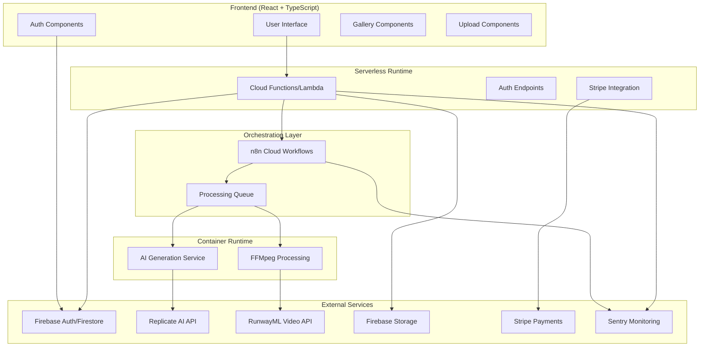

# Design Document

## Overview

The Pet Card Generator is a modern web application built with a React frontend and Node.js backend, leveraging AI services for image generation, Firebase for authentication and data persistence, and FFMpeg for animation processing. The architecture follows a serverless approach with auto-scaling capabilities to handle variable load patterns typical of AI-powered applications.

## Architecture

### High-Level Architecture



### Technology Stack

**Frontend:**
- React 18 with TypeScript
- Tailwind CSS for styling
- React Query for state management and caching
- React Router for navigation
- Firebase SDK for authentication

**Backend & Orchestration:**
- **Orchestration**: n8n Cloud (SaaS) for workflow automation and AI pipeline management
- **Serverless Runtime**: Cloud Functions/Lambda for lightweight operations (uploads, auth, payments)
- **Container Runtime**: Cloud Run/ECS/Railway for heavy processing (FFMpeg, AI generation)
- **Core Services**: Node.js with Express and TypeScript
- Firebase Admin SDK for authentication
- Stripe for payment processing

**AI & Media Processing:**
- **AI Generation**: Replicate API for image generation
- **Animation**: FFMpeg for 3-5 frame GIF generation (50-200KB target)
- **Fallback**: 2-frame boomerang effect for performance issues
- **Premium Video**: RunwayML for high-quality MP4 generation

**Infrastructure & Storage:**
- **Authentication**: Firebase Authentication
- **Database**: Firestore for data persistence
- **File Storage**: Firebase Cloud Storage for images and animations
- **Monitoring**: Sentry for full-stack error tracking and performance monitoring
- **Deployment**: Hybrid serverless + container approach

### Tech Stack Decision Matrix

| Decision Area | Chosen Solution | Alternative Considered | Score | Rationale |
|---------------|----------------|----------------------|-------|-----------|
| **Orchestration** | n8n Cloud (SaaS) | Self-hosted n8n, Zapier, Custom workflows | 9/10 | Zero-ops maintenance, SLA uptime guarantees, automatic updates. Perfect for moving fast without DevOps overhead. Built-in error handling and retry logic. |
| **Runtime Architecture** | Hybrid (Serverless + Containers) | Pure serverless, Pure containers, Monolithic | 8/10 | Serverless for lightweight ops (auth, payments), containers for heavy processing (FFMpeg, AI). Optimal cost and performance balance. |
| **AI Image Generation** | Replicate API | OpenAI DALL-E, Midjourney API, Stability AI | 8/10 | Best price/performance ratio, extensive model library, reliable uptime, good documentation. Easy to switch models without code changes. |
| **Animation Processing** | FFMpeg (3-5 frames) | CSS animations, Lottie, Video APIs | 7/10 | Lightweight 50-200KB GIFs, universal compatibility, fine-grained control. Fallback to 2-frame boomerang for performance. |
| **Payment Processing** | Stripe | PayPal, Square, Paddle | 9/10 | Industry standard, excellent developer experience, comprehensive subscription management, strong fraud protection. |
| **Monitoring & Errors** | Sentry | LogRocket, Bugsnag, DataDog | 8/10 | Full-stack error tracking, performance monitoring, excellent React integration, reasonable pricing for startups. |
| **Database** | Firestore | PostgreSQL, MongoDB, Supabase | 7/10 | Real-time updates, offline support, automatic scaling, tight Firebase integration. Trade-off: less complex querying capability. |
| **File Storage** | Firebase Storage | AWS S3, Cloudinary, Uploadcare | 8/10 | Seamless Firebase integration, automatic CDN, built-in security rules, generous free tier. |
| **Frontend Framework** | React 18 + TypeScript | Vue 3, Svelte, Next.js | 9/10 | Mature ecosystem, excellent TypeScript support, large talent pool, extensive component libraries. |
| **Styling** | Tailwind CSS | Styled Components, Emotion, CSS Modules | 8/10 | Rapid prototyping, consistent design system, small bundle size, excellent developer experience. |
| **Frontend Deployment** | Vercel | Netlify, AWS Amplify, GitHub Pages | 9/10 | Fast static hosting, automatic CDN, seamless GitHub integration, excellent React/Next.js support. |
| **Container Platform** | Railway | Cloud Run, ECS, Heroku | 8/10 | Deploy from Git, automatic scaling, simple pricing, great for containerized FFMpeg/AI processing. |
| **CI/CD Pipeline** | GitHub Actions + Railway | GitLab CI, CircleCI, Jenkins | 8/10 | Native GitHub integration, automated tests and linting, one-click rollbacks via Railway. |

### Decision Criteria Weights
- **Performance**: 25% - Critical for AI processing and user experience
- **Developer Experience**: 20% - Important for rapid iteration and team productivity  
- **Cost Efficiency**: 20% - Essential for sustainable unit economics
- **Scalability**: 15% - Must handle variable AI processing loads
- **Ecosystem & Support**: 10% - Long-term maintainability and hiring
- **Time to Market**: 10% - Speed of initial development and deployment

## Components and Interfaces

### Frontend Components

#### Core Components
```typescript
// Main application component
interface AppProps {
  user: User | null;
  loading: boolean;
}

// Upload component for photo processing
interface UploadComponentProps {
  onUpload: (file: File) => Promise<void>;
  isProcessing: boolean;
  maxFileSize: number;
}

// Card display component
interface CardComponentProps {
  card: PetCard;
  showAnimation: boolean;
  onShare: (card: PetCard) => void;
  onEvolution?: (card: PetCard) => void;
}

// Gallery component for collection management
interface GalleryProps {
  cards: PetCard[];
  filters: FilterOptions;
  onFilterChange: (filters: FilterOptions) => void;
  onCardSelect: (card: PetCard) => void;
}
```

#### Authentication Components
```typescript
interface AuthComponentProps {
  onAuthStateChange: (user: User | null) => void;
}

interface UserProfileProps {
  user: User;
  subscription: SubscriptionTier;
  onUpgrade: () => void;
}
```

### Backend API Interfaces

#### Core API Endpoints
```typescript
// Card generation endpoint
POST /api/cards/generate
interface GenerateCardRequest {
  imageFile: File;
  userId: string;
  options?: GenerationOptions;
}

interface GenerateCardResponse {
  cards: PetCard[];
  processingTime: number;
  creditsUsed: number;
}

// Card evolution endpoint
POST /api/cards/:cardId/evolve
interface EvolveCardRequest {
  cardId: string;
  evolutionStage: 2 | 3;
  userId: string;
}

// User collection endpoint
GET /api/users/:userId/cards
interface GetCardsResponse {
  cards: PetCard[];
  totalCount: number;
  pagination: PaginationInfo;
}
```

#### Service Interfaces
```typescript
interface AIGenerationService {
  generateVariants(image: Buffer, options: GenerationOptions): Promise<GeneratedImage[]>;
  enhanceForEvolution(image: Buffer, stage: number): Promise<GeneratedImage>;
}

interface AnimationService {
  createGIF(images: Buffer[], options: AnimationOptions): Promise<Buffer>;
  createVideo(images: Buffer[], options: VideoOptions): Promise<Buffer>;
}

interface RarityService {
  assignRarity(): RarityLevel;
  calculateDistribution(): RarityDistribution;
}
```

## Data Models

### Core Data Models

```typescript
interface User {
  id: string;
  email: string;
  displayName: string;
  subscriptionTier: 'free' | 'premium';
  createdAt: Date;
  lastActiveAt: Date;
  creditsRemaining: number;
}

interface PetCard {
  id: string;
  userId: string;
  originalImageUrl: string;
  generatedImageUrl: string;
  animatedGifUrl: string;
  videoUrl?: string; // Premium only
  rarity: RarityLevel;
  evolutionStage: 1 | 2 | 3;
  metadata: CardMetadata;
  createdAt: Date;
  updatedAt: Date;
}

interface CardMetadata {
  petName?: string;
  breed?: string;
  colors: string[];
  style: string;
  generationModel: string;
  processingTime: number;
  fileSize: number;
}

enum RarityLevel {
  COMMON = 'common',
  UNCOMMON = 'uncommon', 
  RARE = 'rare',
  EPIC = 'epic',
  LEGENDARY = 'legendary',
  SECRET_RARE = 'secret_rare'
}

interface GenerationOptions {
  style?: 'realistic' | 'cartoon' | 'fantasy' | 'cyberpunk';
  variants: number;
  quality: 'standard' | 'high';
}
```

### Database Schema (Firestore)

```typescript
// Users collection
interface UserDocument {
  email: string;
  displayName: string;
  subscriptionTier: string;
  createdAt: Timestamp;
  lastActiveAt: Timestamp;
  creditsRemaining: number;
  preferences: UserPreferences;
}

// Cards collection
interface CardDocument {
  userId: string;
  originalImageUrl: string;
  generatedImageUrl: string;
  animatedGifUrl: string;
  videoUrl?: string;
  rarity: string;
  evolutionStage: number;
  metadata: CardMetadata;
  createdAt: Timestamp;
  updatedAt: Timestamp;
}

// Collections subcollection under users
interface CollectionDocument {
  cardIds: string[];
  totalCards: number;
  rarityBreakdown: Record<RarityLevel, number>;
  lastUpdated: Timestamp;
}
```

## Error Handling

### Error Classification and Handling Strategy

```typescript
enum ErrorType {
  VALIDATION_ERROR = 'validation_error',
  AI_SERVICE_ERROR = 'ai_service_error',
  ANIMATION_ERROR = 'animation_error',
  STORAGE_ERROR = 'storage_error',
  AUTH_ERROR = 'auth_error',
  RATE_LIMIT_ERROR = 'rate_limit_error',
  SYSTEM_ERROR = 'system_error'
}

interface ErrorResponse {
  error: {
    type: ErrorType;
    message: string;
    code: string;
    details?: any;
    retryable: boolean;
  };
  requestId: string;
  timestamp: Date;
}
```

### Error Handling Patterns

**Frontend Error Handling:**
- Global error boundary for React components
- Toast notifications for user-facing errors
- Retry mechanisms for transient failures
- Graceful degradation for non-critical features

**Backend Error Handling:**
- Centralized error middleware
- Structured logging with correlation IDs
- Circuit breaker pattern for external services
- Automatic retry with exponential backoff

**AI Service Fallbacks:**
- Retry failed generations up to 3 times
- Fallback to simpler generation models
- Cache successful generations to reduce API calls
- Queue system for handling high load

## Testing Strategy

### Testing Pyramid

**Unit Tests (70%)**
- Component testing with React Testing Library
- Service layer testing with Jest
- Utility function testing
- Data model validation testing

**Integration Tests (20%)**
- API endpoint testing with Supertest
- Database integration testing
- External service mocking and testing
- Authentication flow testing

**End-to-End Tests (10%)**
- Critical user journey testing with Playwright
- Cross-browser compatibility testing
- Performance testing under load
- Mobile responsiveness testing

### Test Coverage Requirements

```typescript
// Minimum coverage thresholds
const coverageThresholds = {
  global: {
    branches: 80,
    functions: 85,
    lines: 85,
    statements: 85
  },
  './src/services/': {
    branches: 90,
    functions: 95,
    lines: 95,
    statements: 95
  }
};
```

### Testing Scenarios

**Core Functionality Tests:**
- Photo upload and validation
- AI generation with various inputs
- Rarity assignment distribution
- Animation generation and fallbacks
- User authentication flows
- Collection management operations

**Performance Tests:**
- Load testing with concurrent users
- Memory usage during image processing
- API response time benchmarks
- File upload/download performance

**Security Tests:**
- Input validation and sanitization
- Authentication and authorization
- File upload security scanning
- API rate limiting effectiveness

### Monitoring and Observability

**Application Monitoring:**
- Real-time error tracking with Sentry
- Performance monitoring with Web Vitals
- User analytics with privacy-focused tools
- API metrics and alerting

**Infrastructure Monitoring:**
- Serverless function performance
- Database query performance
- External service availability
- Cost monitoring and alerts

**Business Metrics:**
- User activation and retention rates
- Card generation success rates
- Premium conversion metrics
- Feature usage analytics